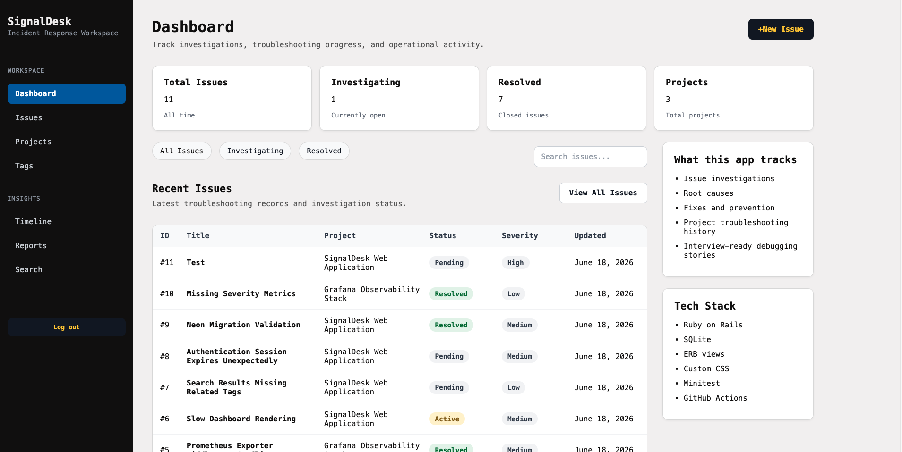
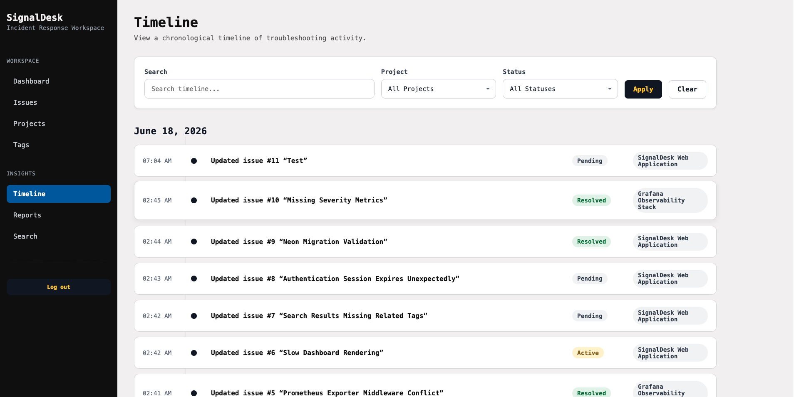
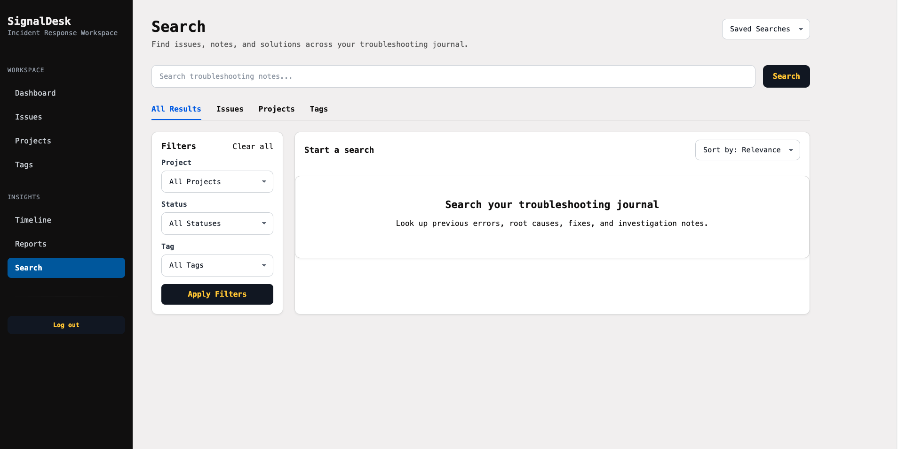
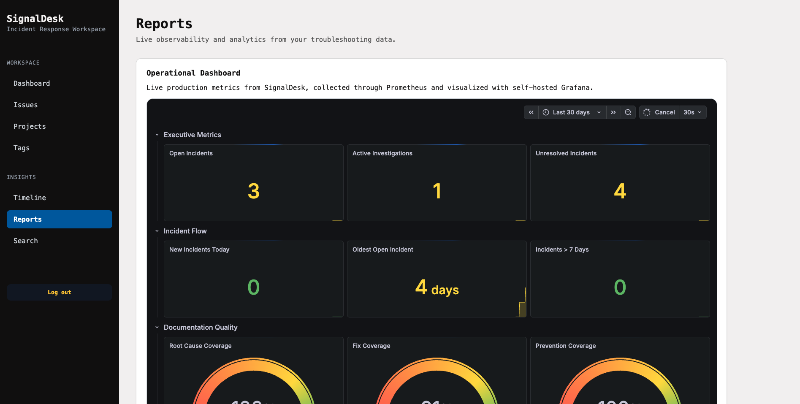
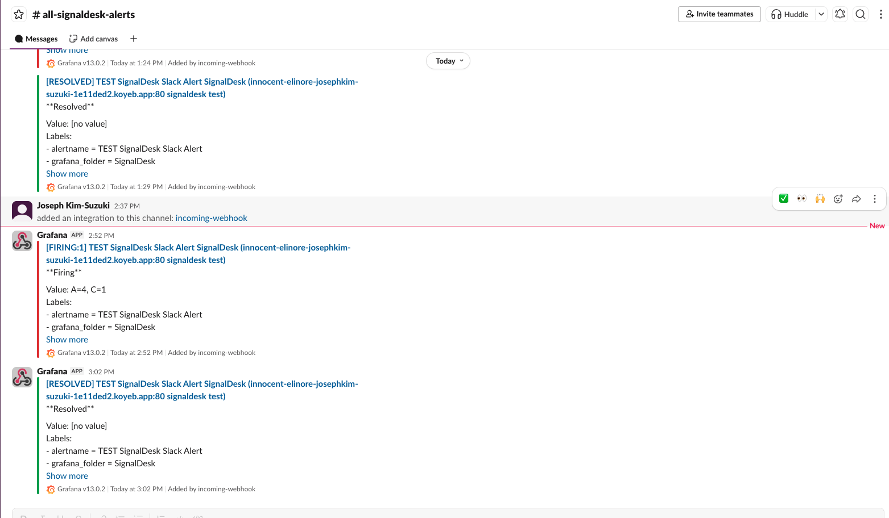

# SignalDesk

SignalDesk is a Rails-based incident tracking and observability platform designed to simulate real-world troubleshooting, incident response, and operational monitoring workflows.

Built as part of my journey toward Resiliency Incident Response, Site Reliability Engineering (SRE), and Production Support Engineering roles, SignalDesk combines issue management, reporting, metrics collection, monitoring, and alerting into a single application.

---

## Overview

SignalDesk helps me to document, investigate, and resolve operational issues while providing visibility into system health through integrated monitoring and alerting.

The application was inspired by the workflows used by Resiliency Incident Response Engineers, Technical Support Engineers, and Site Reliability Engineers who need to track incidents, identify patterns, monitor trends, and respond to operational issues.

---

## Key Features

### Incident Tracking

Create and manage troubleshooting records including:

- Error messages
- Investigation notes
- Root causes
- Resolution steps
- Prevention strategies
- Interview-ready summaries

### Project Management

Organize incidents into projects and track operational issues across multiple systems.

### Tag Management

Categorize incidents using reusable tags for easier filtering and analysis.

### Search & Filtering

Quickly find historical incidents using:

- Full-text search
- Project filters
- Status filters
- Tag filters

### Timeline View

Track troubleshooting activity chronologically and review investigation history over time.

### Reporting Dashboard

Analyze operational trends through:

- Total incidents
- Resolution rates
- Active investigations
- Project breakdowns
- Tag statistics

### Embedded Observability Dashboard

View live operational metrics directly inside the application through an embedded Grafana dashboard.

### Slack Alerting

Receive notifications when:

- Application availability issues occur
- Incident backlog exceeds thresholds
- Aging incidents require attention

---

## Architecture

```text
User
  ↓
Ruby on Rails
  ↓
Neon PostgreSQL
  ↓
Prometheus
  ↓
Grafana
  ↓
Slack Alerting
```

---

## Tech Stack

### Application

- Ruby
- Ruby on Rails 8
- ERB
- HTML5
- CSS3

### Database

- Neon PostgreSQL
- Active Record
- Rails Migrations

### Observability

- Prometheus
- Grafana
- Grafana Alerting
- Custom Rails Metrics Exporter

### Monitoring

- Embedded Grafana Dashboards
- Prometheus Time-Series Storage
- Persistent Metric Retention
- Slack Operational Alerting

### Infrastructure

- Docker
- Supervisor
- Koyeb
- Northflank

### Version Control & CI/CD

- Git
- GitHub
- GitHub Actions

### Testing & Quality

- Automated Rails Tests
- RuboCop

---

## Monitoring & Alerting

SignalDesk includes a self-hosted observability stack designed to monitor application health and operational trends.

### Metrics Collected

- Total incidents
- Resolved incidents
- Active investigations
- Incident backlog
- Resolution rate
- Aging incidents
- Application uptime

### Alert Rules

#### Application Down

Triggers when Prometheus can no longer scrape SignalDesk metrics.

**Severity:** Critical

#### Backlog Too High

Triggers when unresolved incidents exceed the configured threshold.

**Severity:** Warning

#### Aging Incidents

Triggers when incidents remain unresolved beyond the acceptable investigation window.

**Severity:** Warning

### Alert Delivery

Alerts are delivered directly to Slack using Grafana Alerting.

---

## CI/CD

GitHub Actions automatically performs:

- Automated test execution
- Code quality validation
- Deployment checks

This helps ensure application stability before deployment.

---

## Production Environment

### Application Hosting

Hosted on Koyeb.

### Database Hosting

Hosted on Neon PostgreSQL.

### Observability Hosting

Hosted on Northflank.

### Metrics Storage

Prometheus stores historical metrics with:

- 5 GB retention limit
- Up to 3 years of historical retention

### Visualization

Grafana dashboards are embedded directly within the Reports page of the application.

---

## Screenshots

### Dashboard



### Timeline



### Search



### Reports



### Grafana Monitoring


### Slack Alerting



---

## Lessons Learned

Building SignalDesk provided hands-on experience with:

- Rails application architecture
- PostgreSQL database management
- Production deployments
- Metrics collection
- Observability tooling
- Dashboard creation
- Alerting systems
- Infrastructure troubleshooting
- Incident response workflows
- CI/CD pipelines

The project evolved from a simple troubleshooting journal into a production-style application with integrated monitoring and operational visibility.

---

## Future Improvements

- User authentication and authorization
- Team collaboration features
- Incident assignment workflows
- Severity classifications
- Audit logging
- Service ownership mapping
- SLO and Error Budget tracking
- API endpoints
- Multi-tenant support

---

## Author

### Joseph Kim-Suzuki

Built as part of a portfolio focused on:

- Incident Response
- Site Reliability Engineering (SRE)
- Observability
- Troubleshooting
- Production Support Engineering

GitHub: https://github.com/jkimsuzuki